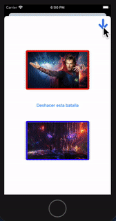

# AvengersApp MVC as project for Persistence module

## Demo Video

## DONE

1.- CoreData model implementation
2.- Data deletion implemented on Battles
3.- Last Tab stored in User Defaults
4.- Data model relationships hard-coded filtering arrays 

## TODO

1.- Refactoring Heroes and Villains ViewControllers and Models as Characters
2.- CLEAN code and organize methods

